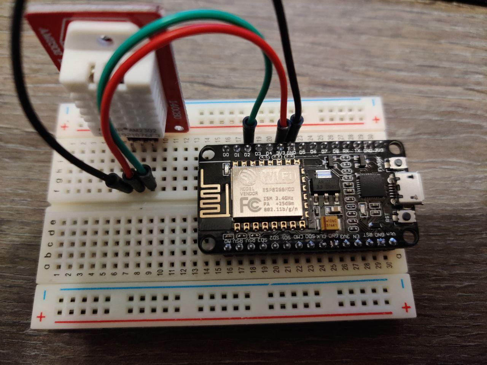
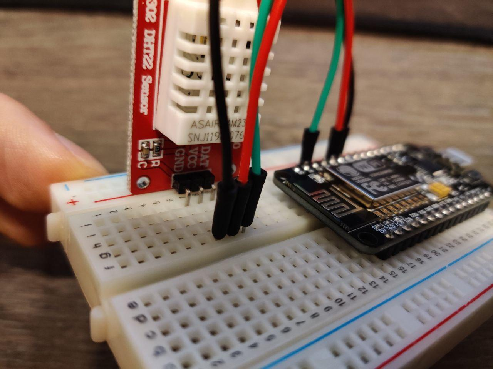
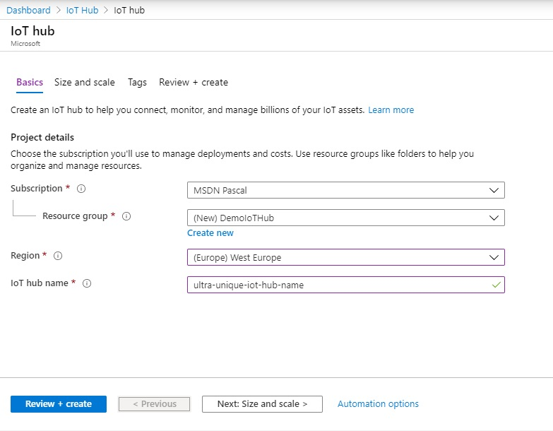
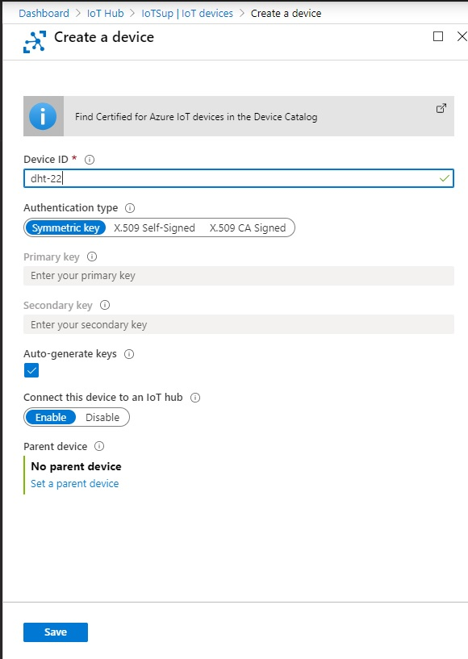
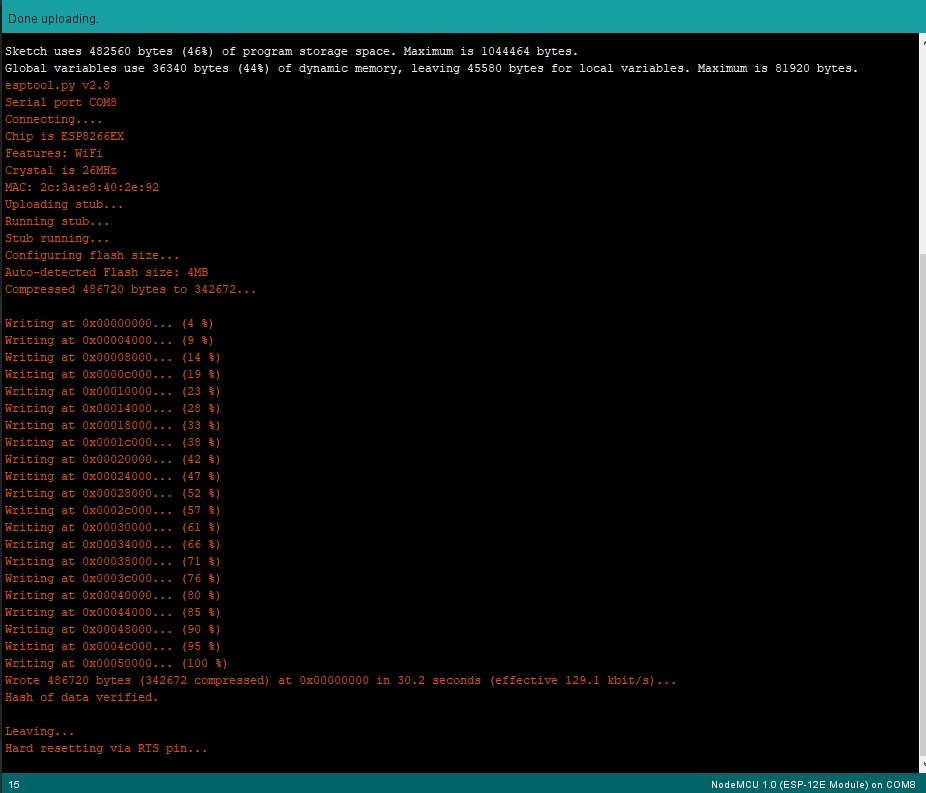
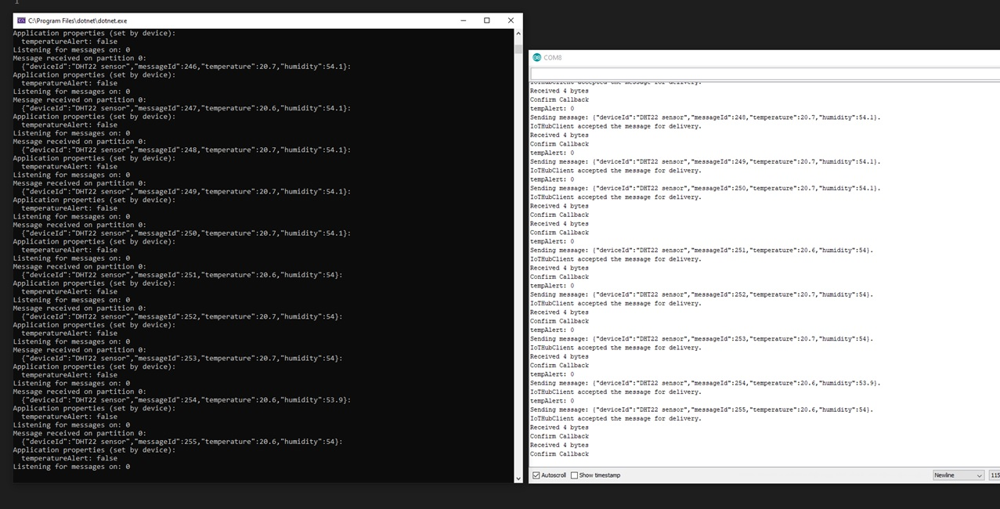

## Prerequisite
Basic knowledge of moving around the Azure Portal.
If you don't know how this works. There are plenty of guide online.
(Pre)Programming knowledge.

## Requirements
**Install the following software:**
- Python [Download here](https://www.python.org/downloads/release/python-382/)
- Arduino IDE [Download here](https://www.arduino.cc/en/main/software)
- Arduino Libraries
    - DHT_sensor_library
    - ArduinoJson (version 5.x)
    - AzureIoTHub
    - AzureProtocol_MQTT
    - AzureIoTUtility

- (Optional)VS Code Plugin for arduino [Checkout here](https://marketplace.visualstudio.com/items?itemName=vsciot-vscode.vscode-arduino)

- (Optional)VS Code intellisense [Checkout here](https://cuneyt.aliustaoglu.biz/en/enabling-arduino-intellisense-with-visual-studio-code/)

**Obtain the following hardware:**
- DHT22 
- NodeMCU ESP 8266
- Breadboard + breadboard cables

**Azure cloud**
- Have an already runningIoT Hub 
- Azure account with to create an IoT Hub (Free tier is available)

## Lets get started

### Setup the board
To setup the board 3 pins need to be connected from the board to the sensor.
1. Connect pin `D2` on the board to `DAT` on the sensor
2. Connect ground `G` on the board to `GND`  on the sensor
3. Connect 3.3V `3V` on the board to `VCC` on the sensor

 

### Setup the environment
1. Install esp8266 driver File -> preference past the following line at:  'Additional Boards Manger Urls:' `http://arduino.esp8266.com/stable/package_esp8266com_index.json`
2. Install the board: Tools -> Board: -> Board Manager and search on 'esp8266' and install (minimal version 2.5.2)
3. Select the board: Tools -> Board: and select 'NodeMCu 1.0(ESP 12E Module)'
4. Install libraries Tools -> Manage Libraries... and typ in the name of the libraries
5. Configure the compiler so it could compile the Azure IoT packages
    1. Navigate to and open the `Arduino.h` file (in my case) `%localappdata%\Arduino15\packages\esp8266\hardware\esp8266\2.6.3\cores\esp8266` 
    2. Comment out line `#define round(x)     ((x)>=0?(long)((x)+0.5):(long)((x)-0.5))` at line 137
    3. Navigate and open  `platform.txt` at `%localappdata%\Arduino15\packages\esp8266\hardware\esp8266\2.6.3`
    4. Add the following 2 keywords to line that contains `build.extra_flags=` (line 80) `-DDONT_USE_UPLOADTOBLOB -DUSE_BALTIMORE_CERT`
6. Copy the example code folder to your arduino sketch directory
7. Open the Code and press the 'verify/ compile button' or press `CTRL+R` if the code compiles the software is setup correctly

_note: that the code is based on the following documentation: [https://github.com/Azure/azure-iot-arduino](https://github.com/Azure/azure-iot-arduino)_

### Setup Azure IoT Hub
**Configure IoT Hub**
1. Go to the Azure Portal and search for IoT Hub.
2. Press the 'Create IoT Hub' button or 'Add' button if there is already some created.
3. Fill in the field and pres on 'Next: Size and scale >

    
4. Here you can change the tier from Standard tier to basic tier (_note: there can only be one free IoT Hub an a subscription_)
5. Fill in any other fields to your likings and press 'Review + Create'.

**Setup an device within IoT Hub**
1. Once the IoT Hub is created navigate to that resource.
2. On the left bar select 'IoT devices' and create a new one. 
3. Give it a logic name and keep it on Symmetric key and save the device.
    
    
4. Click on the newly created device to see the 'Primary Connection String' This is needed within our code on the next step.
5. Navigate back to the IoT Hub and select 'Shared access policies' then click on 'service' this should popup a window with more keys. These are also need for the next step.

### Setup the actual code
- Open the code folder in the arduino IDE
- Navigate to `iot_configs.h` and fill in or edit the following fields
    - IOT_CONFIG_WIFI_SSID
    - IOT_CONFIG_WIFI_PASSWORD
    - DEVICE_CONNECTION_STRING
    - DHT_PIN
    - INTERVAL

### Compile and deploy
**When all configurations are set it is time to compile the code and send it to the device.**
- To send the code you need to select the right settings. by default they are oke.
- Change the COM port to the matching device. (Unplug the device and check what COM port is missing to determine what port you need to select)
- Once the right COM port is selected press the "upload" button or press `CTRL+U` to upload

    
 

### Check if data is sending and receiving
- Create a new console app and include the following code [Get template](https://github.com/Azure-Samples/azure-iot-samples-csharp/blob/master/iot-hub/Quickstarts/read-d2c-messages/ReadDeviceToCloudMessages.cs)
- Fill in the missing keys that are acquired from the Azure Portal
- Run the code to seen the packages come in from IoT Hub via the Event Hub.
- Run the arduino "Serial Monitor" Tools -> Serial Monitor to monitor the outgoing readings and make sure the Baud rate is set to `115200`.
    
    

